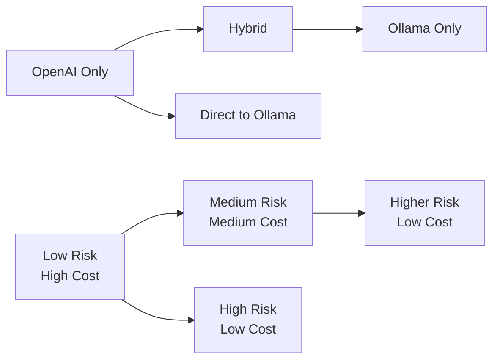

# AI Provider Comparison Guide

This guide helps you choose the right AI provider configuration for your specific use case, comparing OpenAI, Ollama, and hybrid approaches across different dimensions.

## Executive Summary

| Provider | Best For | Key Advantage | Main Limitation |
|----------|----------|---------------|-----------------|
| **OpenAI** | Production, reliability | High accuracy, speed | API costs, data privacy |
| **Ollama** | Local development, privacy | Free, private, customizable | Setup complexity, resource usage |
| **Hybrid** | Cost optimization | Balanced cost/performance | Configuration complexity |

## Detailed Provider Comparison

### Performance Comparison

| Metric | OpenAI | Ollama | Hybrid (OpenAI Embeddings + Ollama LLM) |
|--------|--------|--------|------------------------------------------|
| **Embedding Speed** | ⭐⭐⭐⭐⭐ | ⭐⭐⭐ | ⭐⭐⭐⭐⭐ |
| **LLM Response Speed** | ⭐⭐⭐⭐⭐ | ⭐⭐⭐ | ⭐⭐⭐ |
| **Accuracy** | ⭐⭐⭐⭐⭐ | ⭐⭐⭐⭐ | ⭐⭐⭐⭐⭐ |
| **Reliability** | ⭐⭐⭐⭐⭐ | ⭐⭐⭐ | ⭐⭐⭐⭐ |
| **Consistency** | ⭐⭐⭐⭐⭐ | ⭐⭐⭐⭐ | ⭐⭐⭐⭐ |

**Benchmark Results (Embeddings - 100 texts):**
- OpenAI: ~2-3 seconds
- Ollama: ~8-12 seconds  
- Hybrid: ~2-3 seconds (embeddings only)

**Benchmark Results (LLM - Single query):**
- OpenAI: ~1-2 seconds
- Ollama: ~5-15 seconds (depends on model size)
- Hybrid: ~5-15 seconds (Ollama LLM speed)

### Cost Analysis

| Component | OpenAI | Ollama | Hybrid |
|-----------|--------|--------|--------|
| **Embeddings** | $0.02/1M tokens | Free | $0.02/1M tokens |
| **LLM Queries** | $0.15-0.60/1M tokens | Free | Free |
| **Infrastructure** | None | Server costs | Server costs |
| **Monthly Est. (1M embeddings, 10K queries)** | $20-60 | $50-200 (server) | $20-25 + server |

**Cost Optimization Strategies:**

1. **High Volume, Budget Conscious**: Full Ollama
2. **Quality Embeddings, Cost-Conscious LLM**: Hybrid
3. **Premium Service**: Full OpenAI
4. **Experimentation**: Start with Ollama, upgrade to hybrid

### Resource Requirements

#### OpenAI
- **Local Resources**: Minimal (just API calls)
- **Network**: Stable internet required
- **Dependencies**: Python OpenAI library

#### Ollama
- **RAM**: 4-8GB minimum, 8-16GB recommended
- **Storage**: 2-10GB per model
- **CPU**: Multi-core recommended
- **GPU**: Optional but significantly improves performance

#### Hybrid
- **Local Resources**: Same as Ollama (for LLM)
- **Network**: Internet for OpenAI embeddings
- **Best of Both**: Reduced local resource usage vs. full Ollama

### Privacy and Security

| Aspect | OpenAI | Ollama | Hybrid |
|--------|--------|--------|--------|
| **Data Privacy** | ⭐⭐ | ⭐⭐⭐⭐⭐ | ⭐⭐⭐ |
| **Data Residency** | US/EU (OpenAI servers) | Local | Mixed |
| **Compliance** | SOC 2, GDPR compliant | Full control | Mixed |
| **Audit Trail** | OpenAI logs | Local logs | Mixed |

**Privacy Considerations:**
- **OpenAI**: Data sent to OpenAI servers, subject to their privacy policy
- **Ollama**: All data stays local, full control
- **Hybrid**: Embeddings go to OpenAI, LLM queries stay local

## Use Case Recommendations

### When to Choose OpenAI

**Best For:**
- Production applications requiring maximum reliability
- Applications with strict accuracy requirements
- Teams without local infrastructure management capacity
- Rapid prototyping and MVP development

**Configuration Example:**
```bash
AI_PROVIDER=openai
OPENAI_API_KEY=your_key
OPENAI_EMBEDDING_MODEL=text-embedding-3-small
OPENAI_LLM_MODEL=gpt-4o-mini
VECTOR_DB_PROVIDER=supabase
```

**Pros:**
- ✅ Highest accuracy and reliability
- ✅ No local infrastructure required
- ✅ Regular model updates and improvements
- ✅ Excellent documentation and support
- ✅ Fast response times

**Cons:**
- ❌ Ongoing API costs
- ❌ Data leaves your infrastructure
- ❌ Dependent on internet connectivity
- ❌ Subject to rate limits and service availability

### When to Choose Ollama

**Best For:**
- Privacy-sensitive applications
- Cost-conscious development
- Applications requiring full data control
- Learning and experimentation environments
- Offline or air-gapped deployments

**Configuration Example:**
```bash
AI_PROVIDER=ollama
OLLAMA_BASE_URL=http://localhost:11434
OLLAMA_EMBEDDING_MODEL=nomic-embed-text
OLLAMA_LLM_MODEL=llama3.2:1b
VECTOR_DB_PROVIDER=sqlite
```

**Pros:**
- ✅ No ongoing API costs
- ✅ Complete data privacy
- ✅ Full control over models and updates
- ✅ Works offline
- ✅ Customizable model selection

**Cons:**
- ❌ Requires local infrastructure
- ❌ Slower than OpenAI
- ❌ Setup and maintenance overhead
- ❌ Model management complexity
- ❌ Resource intensive

### When to Choose Hybrid

**Best For:**
- Cost optimization with quality embeddings
- Applications with high LLM usage but moderate embedding needs
- Organizations wanting to reduce OpenAI dependency gradually
- Balancing performance and cost

**Configuration Example:**
```bash
AI_PROVIDER=mixed
EMBEDDING_PROVIDER=openai
LLM_PROVIDER=ollama
OPENAI_API_KEY=your_key
OLLAMA_BASE_URL=http://localhost:11434
VECTOR_DB_PROVIDER=supabase
```

**Pros:**
- ✅ High-quality embeddings from OpenAI
- ✅ Reduced API costs (LLM queries free)
- ✅ Flexibility to optimize each component
- ✅ Gradual migration path

**Cons:**
- ❌ More complex configuration
- ❌ Still requires local infrastructure for LLM
- ❌ Mixed privacy model
- ❌ Two systems to monitor and maintain

## Deployment Scenario Recommendations

### Startup/MVP Development
**Recommendation**: OpenAI
- Focus on product development, not infrastructure
- Predictable costs during validation phase
- Fast iteration and reliable results

### Enterprise Development
**Recommendation**: Hybrid → Full Ollama
- Start with hybrid for balanced approach
- Migrate to Ollama for production privacy/control
- Dedicated infrastructure team to manage

### Research/Academic
**Recommendation**: Ollama
- Cost-effective for experimentation
- Full control over models and data
- Good for understanding AI model behavior

### Compliance-Heavy Industries
**Recommendation**: Ollama
- Healthcare, finance, government applications
- Data residency requirements
- Full audit trail control

### High-Volume Applications
**Recommendation**: Hybrid or Ollama
- Embedding costs can be significant at scale
- LLM costs grow quickly with usage
- Infrastructure investment pays off at scale

## Migration Paths

### Progressive Migration Strategy



**Phase 1: OpenAI (Current State)**
- Establish baseline performance and costs
- Understand usage patterns
- Build monitoring and metrics

**Phase 2: Hybrid (Risk Mitigation)**
- Reduce LLM costs while maintaining embedding quality
- Test local infrastructure capabilities
- Compare performance and costs

**Phase 3: Full Ollama (Maximum Control)**
- Achieve complete cost control and privacy
- Full local infrastructure management
- Custom model optimization

## Performance Tuning by Provider

### OpenAI Optimization

```bash
# Optimize for speed
OPENAI_MAX_BATCH_SIZE=100
OPENAI_TIMEOUT=30.0

# Optimize for accuracy
OPENAI_EMBEDDING_MODEL=text-embedding-3-large
OPENAI_LLM_MODEL=gpt-4o

# Optimize for cost
OPENAI_EMBEDDING_MODEL=text-embedding-3-small
OPENAI_LLM_MODEL=gpt-4o-mini
```

### Ollama Optimization

```bash
# High-performance setup (16GB+ RAM)
OLLAMA_LLM_MODEL=llama3.1:8b
OLLAMA_EMBEDDING_MODEL=mxbai-embed-large

# Balanced setup (8-16GB RAM)
OLLAMA_LLM_MODEL=llama3.2:3b
OLLAMA_EMBEDDING_MODEL=nomic-embed-text

# Low-resource setup (4-8GB RAM)
OLLAMA_LLM_MODEL=llama3.2:1b
OLLAMA_EMBEDDING_MODEL=nomic-embed-text
OLLAMA_MAX_BATCH_SIZE=5
```

### Hybrid Optimization

```bash
# Quality-focused hybrid
EMBEDDING_PROVIDER=openai
OPENAI_EMBEDDING_MODEL=text-embedding-3-large
LLM_PROVIDER=ollama
OLLAMA_LLM_MODEL=llama3.1:8b

# Cost-focused hybrid
EMBEDDING_PROVIDER=openai
OPENAI_EMBEDDING_MODEL=text-embedding-3-small
LLM_PROVIDER=ollama
OLLAMA_LLM_MODEL=llama3.2:1b
```

## Decision Matrix

Use this matrix to evaluate your specific requirements:

| Requirement | Weight | OpenAI Score | Ollama Score | Hybrid Score |
|-------------|--------|--------------|--------------|--------------|
| **Accuracy** | 5 | 5 | 4 | 5 |
| **Speed** | 4 | 5 | 3 | 4 |
| **Cost Control** | 5 | 2 | 5 | 4 |
| **Privacy** | 3 | 2 | 5 | 3 |
| **Reliability** | 5 | 5 | 3 | 4 |
| **Ease of Setup** | 2 | 5 | 2 | 3 |
| **Maintenance** | 3 | 5 | 2 | 3 |

**Calculation Example (your weights may vary):**
```
Weighted Score = Σ(Requirement Weight × Provider Score)

OpenAI: (5×5 + 4×5 + 5×2 + 3×2 + 5×5 + 2×5 + 3×5) = 114
Ollama: (5×4 + 4×3 + 5×5 + 3×5 + 5×3 + 2×2 + 3×2) = 96
Hybrid: (5×5 + 4×4 + 5×4 + 3×3 + 5×4 + 2×3 + 3×3) = 115
```

## Real-World Case Studies

### Case Study 1: SaaS Startup - Document Analysis

**Requirements:**
- Budget: $500/month
- Users: 1,000 active users
- Privacy: Standard (non-sensitive)
- Accuracy: High importance

**Decision**: OpenAI → Hybrid migration
- Started with OpenAI for MVP
- Migrated to hybrid after 6 months to control costs
- 60% cost reduction while maintaining quality

### Case Study 2: Healthcare Platform - Medical Records

**Requirements:**
- Budget: $10,000/month
- Privacy: HIPAA compliance required
- Accuracy: Critical
- Availability: 99.9% uptime required

**Decision**: Full Ollama deployment
- Complete data control for compliance
- Custom model fine-tuning for medical terminology
- Dedicated infrastructure team

### Case Study 3: Research Institution - Academic Papers

**Requirements:**
- Budget: $1,000/month
- Volume: High (research corpus)
- Privacy: Moderate (published papers)
- Experimentation: High importance

**Decision**: Ollama with OpenAI fallback
- Primary Ollama for cost control
- OpenAI for comparison and validation
- Model experimentation capabilities

## Monitoring and Metrics

### Key Metrics to Track

**Performance Metrics:**
- Response time (embeddings, LLM queries)
- Throughput (requests/second)
- Error rates
- Resource utilization (RAM, CPU, GPU)

**Cost Metrics:**
- API costs (OpenAI)
- Infrastructure costs (Ollama)
- Cost per operation
- Monthly spend trends

**Quality Metrics:**
- Embedding similarity scores
- LLM response accuracy
- User satisfaction scores
- A/B test results

### Monitoring Setup

```bash
# Built-in health checks
./scripts/health_check.py --provider your_provider --env your_env

# Performance monitoring
docker compose --profile monitoring up -d
# Access Grafana at http://localhost:3000

# Cost tracking (OpenAI)
python -c "
from utils_refactored import get_ai_provider_metrics
metrics = get_ai_provider_metrics()
print(f'OpenAI requests: {metrics.get(\"openai\", {}).get(\"request_count\", 0)}')
"
```

## Future Considerations

### Emerging Trends
- **Local LLM Performance**: Ollama models improving rapidly
- **API Cost Reduction**: OpenAI costs trending downward
- **Hybrid Cloud Solutions**: Best of both worlds becoming easier
- **Model Specialization**: Task-specific models for better efficiency

### Technology Roadmap
- Support for additional providers (Anthropic, Cohere)
- Advanced cost optimization algorithms
- Automatic provider failover
- Model performance benchmarking tools

## Quick Decision Guide

**Choose OpenAI if:**
- You need maximum reliability and accuracy
- You have budget for API costs
- You want minimal setup complexity
- You're building an MVP or prototype

**Choose Ollama if:**
- Privacy and data control are paramount
- You want to minimize ongoing costs
- You have infrastructure management capabilities
- You need offline operation

**Choose Hybrid if:**
- You want to optimize costs while maintaining quality
- You have moderate infrastructure capabilities
- You want flexibility to adjust based on usage patterns
- You're planning a gradual migration strategy

**Still Unsure?**
Start with OpenAI for simplicity, then evaluate hybrid or Ollama based on your actual usage patterns and requirements.