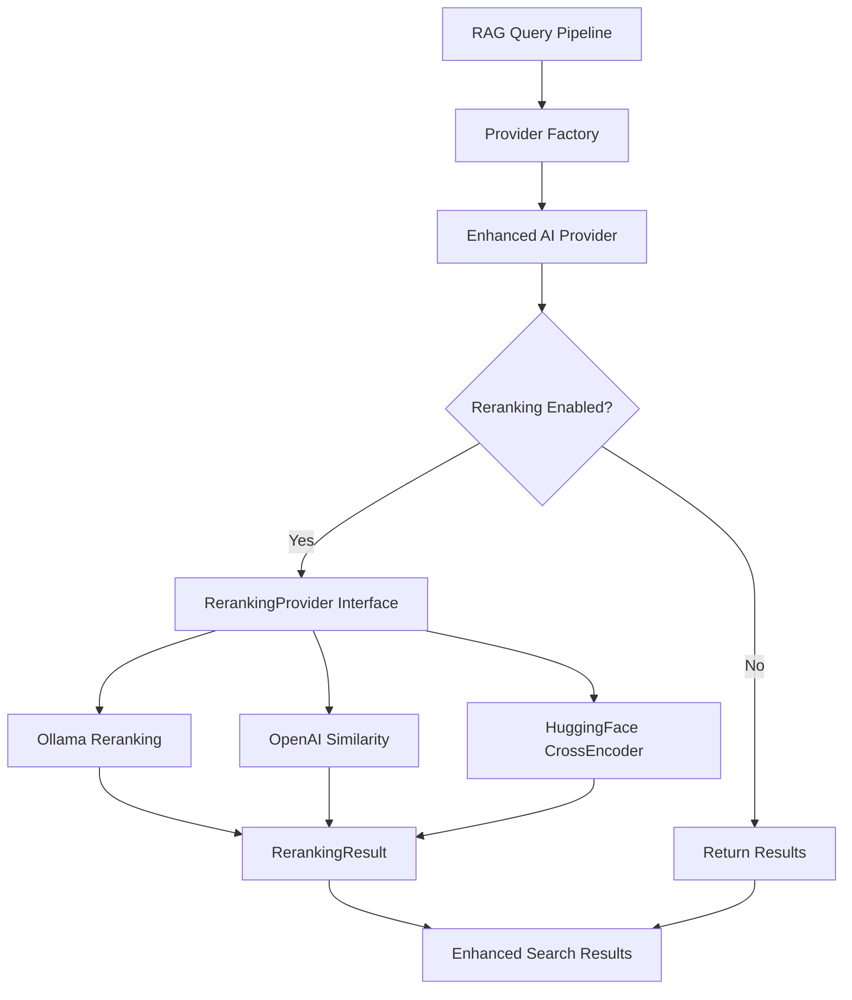

# Provider-Agnostic Reranking Architecture

## Introduction

This document outlines the architectural approach for enhancing the MCP Crawl4AI RAG system with provider-agnostic reranking capabilities. The primary goal is to replace the hardcoded HuggingFace CrossEncoder with a flexible reranking system that integrates seamlessly with the existing AI provider abstraction layer.

### Relationship to Existing Architecture

This enhancement extends the existing AI provider architecture by adding reranking capabilities while maintaining full backward compatibility. The design follows established patterns in the system and requires no changes to the existing API surface.

### Existing Project Analysis

**Current Project State:**
- **Primary Purpose:** MCP server providing RAG functionality with web crawling and vector search
- **Current Tech Stack:** Python 3.13, FastMCP, Crawl4AI, SQLite/Supabase/Neo4j vector databases, AI provider abstraction
- **Architecture Style:** Modular provider-based architecture with dependency injection
- **Deployment Method:** Local development with Docker orchestration support

**Available Documentation:**
- AI provider system fully documented in `src/ai_providers/`
- Existing reranking implementation in `crawl4ai_mcp_refactored.py:244`
- Configuration patterns established in `src/ai_providers/config.py`
- Testing framework in `tests/test_ai_providers.py`

**Identified Constraints:**
- Must maintain existing `perform_rag_query` API compatibility
- Cannot break existing provider configurations
- Must support graceful fallback when reranking unavailable
- Performance impact must be minimal or positive

## Enhancement Scope and Integration Strategy

### Enhancement Overview
- **Enhancement Type:** Brownfield extension of existing AI provider system
- **Scope:** Add reranking capability to AI provider abstraction without breaking changes
- **Integration Impact:** Low - extends existing patterns with optional functionality

### Integration Approach
- **Code Integration Strategy:** Extend existing AI provider interfaces and factory pattern
- **Database Integration:** No database schema changes required
- **API Integration:** Maintain existing FastMCP API surface, enhance internal processing
- **UI Integration:** N/A - Backend enhancement only

### Compatibility Requirements
- **Existing API Compatibility:** 100% - No changes to `perform_rag_query` interface
- **Database Schema Compatibility:** 100% - No schema changes required
- **UI/UX Consistency:** N/A - Backend only
- **Performance Impact:** Neutral to positive (removes external HuggingFace dependency)

## Tech Stack Alignment

### Existing Technology Stack
| Category | Current Technology | Version | Usage in Enhancement | Notes |
|----------|-------------------|---------|---------------------|-------|
| Runtime | Python | 3.13 | Core implementation language | Maintained |
| Framework | FastMCP | Latest | Server framework | No changes |
| AI Providers | Custom abstraction | v1.0 | Extended with reranking interface | Core extension point |
| HTTP Client | aiohttp | Latest | Provider communication | Maintained for external APIs |
| Configuration | Environment variables | N/A | Enhanced with reranking config | Follows existing patterns |
| Testing | pytest | Latest | Test new reranking functionality | Maintained |

### New Technology Additions
No new external technologies required - enhancement leverages existing stack completely.

## Data Models and Schema Changes

### New Data Models

#### RerankingResult
**Purpose:** Standardize reranking output across all providers
**Integration:** Used by all reranking providers as return type

**Key Attributes:**
- `results`: List[Dict[str, Any]] - Reranked search results with scores
- `model`: str - Model used for reranking
- `provider`: str - Provider that performed reranking
- `rerank_scores`: List[float] - Individual reranking scores
- `processing_time_ms`: float - Time taken for reranking operation

**Relationships:**
- **With Existing:** Integrates with existing search result format
- **With New:** Core data type for all reranking operations

### Schema Integration Strategy
**Database Changes Required:** None
**Backward Compatibility:** 100% maintained - purely in-memory operations

## Component Architecture

### New Components

#### RerankingProvider Interface
**Responsibility:** Abstract base class defining reranking capabilities for AI providers
**Integration Points:** 
- Extends existing provider pattern in `src/ai_providers/base.py`
- Integrated into provider factory system
- Used by RAG pipeline for result enhancement

**Key Interfaces:**
- `async def rerank_results(query: str, results: List[Dict], model: Optional[str] = None) -> RerankingResult`
- `def get_reranking_models() -> List[str]`
- `def supports_reranking() -> bool`

**Dependencies:**
- **Existing Components:** AIProvider base classes, factory pattern
- **New Components:** RerankingResult data model

**Technology Stack:** Python async/await, existing provider architecture patterns

#### Enhanced OllamaProvider
**Responsibility:** Implement reranking using Ollama models (bge-reranker-base, etc)
**Integration Points:**
- Extends existing `OllamaProvider` in `src/ai_providers/providers/ollama_provider.py`
- Uses existing Ollama HTTP client infrastructure
- Integrates with existing configuration system

**Key Interfaces:**
- Implements `RerankingProvider` interface
- Maintains existing embedding and LLM capabilities
- Adds reranking model management

**Dependencies:**
- **Existing Components:** OllamaProvider, HTTP client session, configuration system
- **New Components:** RerankingProvider interface

**Technology Stack:** aiohttp for Ollama API, existing async patterns

#### Enhanced OpenAIProvider  
**Responsibility:** Implement reranking using embedding similarity scoring
**Integration Points:**
- Extends existing `OpenAIProvider` in `src/ai_providers/providers/openai_provider.py`
- Uses existing OpenAI client and embedding generation
- Fallback implementation using cosine similarity

**Key Interfaces:**
- Implements `RerankingProvider` interface  
- Leverages existing embedding generation for similarity scoring
- Maintains existing embedding and LLM capabilities

**Dependencies:**
- **Existing Components:** OpenAIProvider, OpenAI client, embedding generation
- **New Components:** RerankingProvider interface, similarity calculation utilities

**Technology Stack:** OpenAI API client, numpy for similarity calculations

#### Enhanced HuggingFaceProvider
**Responsibility:** Maintain existing CrossEncoder functionality as provider option
**Integration Points:**
- New provider implementation following existing patterns
- Encapsulates current hardcoded CrossEncoder logic
- Provides migration path from current implementation

**Key Interfaces:**
- Implements `RerankingProvider` interface
- Wraps sentence-transformers CrossEncoder
- Handles HuggingFace authentication and model loading

**Dependencies:**
- **Existing Components:** Provider factory, configuration system
- **New Components:** RerankingProvider interface
- **External:** sentence-transformers, transformers library

**Technology Stack:** HuggingFace transformers, sentence-transformers

### Component Interaction Diagram



## API Design and Integration

### API Integration Strategy
**API Integration Strategy:** Internal enhancement - no external API changes
**Authentication:** Leverages existing provider authentication systems
**Versioning:** No versioning required - backward compatible enhancement

### Enhanced Internal Interfaces

#### RerankingProvider Interface
**Purpose:** Define standard reranking capabilities
**Integration:** Extends existing provider interfaces

**Core Methods:**
```python
async def rerank_results(
    self, 
    query: str, 
    results: List[Dict[str, Any]], 
    model: Optional[str] = None
) -> RerankingResult

def supports_reranking(self) -> bool

def get_reranking_models(self) -> List[str]

def get_default_reranking_model(self) -> str
```

#### Enhanced Factory Interface
**Purpose:** Create providers with reranking capabilities
**Integration:** Extends existing `AIProviderFactory`

**Enhanced Methods:**
```python
@classmethod
def create_provider_with_reranking(
    cls, 
    provider_type: AIProvider, 
    config: Dict[str, Any]
) -> Union[EmbeddingProvider, LLMProvider, RerankingProvider]
```

## External API Integration

### Ollama API Integration
- **Purpose:** Access Ollama reranking models (bge-reranker-base, bge-reranker-large)
- **Documentation:** https://ollama.ai/library/bge-reranker-base
- **Base URL:** Configurable via OLLAMA_BASE_URL (e.g., RunPod endpoints)
- **Authentication:** None required for Ollama
- **Integration Method:** HTTP POST to `/api/generate` endpoint with reranking prompt

**Key Endpoints Used:**
- `POST /api/generate` - Submit query and document pairs for reranking
- `GET /api/tags` - Verify model availability

**Error Handling:** Graceful fallback to no reranking if model unavailable

### OpenAI API Integration (Enhanced)
- **Purpose:** Use existing embedding API for similarity-based reranking
- **Documentation:** https://platform.openai.com/docs/api-reference/embeddings
- **Base URL:** https://api.openai.com/v1
- **Authentication:** Existing API key configuration
- **Integration Method:** Leverage existing embedding generation, compute cosine similarity

**Enhanced Usage:**
- Generate embeddings for query and each result
- Compute similarity scores using cosine similarity
- Sort results by similarity score descending

**Error Handling:** Use existing OpenAI error handling patterns

### HuggingFace API Integration (Fallback)
- **Purpose:** Maintain compatibility with existing CrossEncoder approach
- **Documentation:** https://huggingface.co/cross-encoder/ms-marco-MiniLM-L-6-v2
- **Base URL:** https://huggingface.co (for model downloads)
- **Authentication:** HuggingFace token for model access
- **Integration Method:** Local model loading with sentence-transformers

**Error Handling:** Clear error messages for authentication failures

## Source Tree Integration

### Existing Project Structure
```
src/
├── ai_providers/
│   ├── __init__.py
│   ├── base.py                 # Base provider interfaces
│   ├── config.py              # Provider configuration
│   ├── factory.py             # Provider factory
│   └── providers/
│       ├── __init__.py
│       ├── ollama_provider.py # Ollama implementation
│       └── openai_provider.py # OpenAI implementation
├── crawl4ai_mcp_refactored.py # Main MCP server
└── utils_abstracted.py       # Utility functions
```

### New File Organization
```
src/
├── ai_providers/
│   ├── base.py                # Enhanced with RerankingProvider interface
│   ├── config.py              # Enhanced with reranking configuration
│   ├── factory.py             # Enhanced with reranking provider creation
│   └── providers/
│       ├── ollama_provider.py # Enhanced with reranking capability
│       ├── openai_provider.py # Enhanced with similarity reranking
│       └── huggingface_provider.py # NEW: HuggingFace provider
├── reranking/                 # NEW: Reranking utilities
│   ├── __init__.py
│   ├── similarity.py          # Similarity calculation utilities
│   └── models.py              # RerankingResult and related models
└── tests/
    ├── test_reranking_providers.py # NEW: Reranking tests
    └── test_reranking_integration.py # NEW: Integration tests
```

### Integration Guidelines
- **File Naming:** Follow existing snake_case convention
- **Folder Organization:** Group by functionality, extend existing structure
- **Import/Export Patterns:** Use existing relative import patterns, maintain __init__.py exports

## Infrastructure and Deployment Integration

### Existing Infrastructure
**Current Deployment:** Local development with Docker support, MCP server on localhost:8051
**Infrastructure Tools:** Docker, environment variables, virtual environments
**Environments:** Local development (.env.local), production configurations

### Enhancement Deployment Strategy
**Deployment Approach:** Zero-downtime enhancement - configuration-driven activation
**Infrastructure Changes:** None required - purely application-level enhancement
**Pipeline Integration:** Leverages existing testing and deployment workflows

### Rollback Strategy
**Rollback Method:** Environment variable toggle (`USE_RERANKING=false`)
**Risk Mitigation:** Graceful fallback to non-reranked results maintains functionality
**Monitoring:** Leverage existing logging, add reranking-specific metrics

## Coding Standards and Conventions

### Existing Standards Compliance
**Code Style:** Black formatting, type hints, async/await patterns
**Linting Rules:** flake8, mypy type checking
**Testing Patterns:** pytest with async support, provider mocking patterns
**Documentation Style:** Google-style docstrings, comprehensive type annotations

### Enhancement-Specific Standards
- **Reranking Interface:** All reranking methods must be async and return RerankingResult
- **Error Handling:** Must gracefully fallback to no reranking on provider failures
- **Configuration Validation:** All reranking config must validate at startup
- **Performance Monitoring:** All reranking operations must include timing metrics

### Critical Integration Rules
- **Existing API Compatibility:** Never modify `perform_rag_query` signature
- **Database Integration:** No database schema changes permitted
- **Error Handling:** All reranking failures must preserve existing RAG functionality
- **Logging Consistency:** Use existing logger patterns with reranking-specific prefixes

## Testing Strategy

### Integration with Existing Tests
**Existing Test Framework:** pytest with asyncio support, provider mocking patterns
**Test Organization:** Tests organized by component in `tests/` directory
**Coverage Requirements:** Maintain existing 80%+ coverage, add reranking coverage

### New Testing Requirements

#### Unit Tests for New Components
- **Framework:** pytest with async support
- **Location:** `tests/test_reranking_providers.py`
- **Coverage Target:** 90%+ for new reranking code
- **Integration with Existing:** Follow existing provider test patterns

#### Integration Tests
- **Scope:** Full RAG pipeline with reranking enabled/disabled
- **Existing System Verification:** Ensure no regression in existing RAG functionality
- **New Feature Testing:** Verify reranking improves result quality

#### Regression Testing
- **Existing Feature Verification:** All existing tests must pass without modification
- **Automated Regression Suite:** Extend existing CI/CD pipeline
- **Manual Testing Requirements:** Configuration validation across all provider types

### Key Test Scenarios
- Provider initialization with/without reranking configuration
- Reranking quality comparison across providers
- Graceful fallback when models unavailable
- Performance impact measurement
- Configuration edge cases and error handling

## Security Integration

### Existing Security Measures
**Authentication:** Provider-specific API key management
**Authorization:** N/A - single-tenant MCP server
**Data Protection:** No persistent storage of query data
**Security Tools:** Environment variable security, no credential logging

### Enhancement Security Requirements
**New Security Measures:** 
- Secure handling of HuggingFace tokens
- Validation of reranking model outputs
- Protection against reranking injection attacks

**Integration Points:**
- Reuse existing API key management patterns
- Apply existing input validation to reranking inputs
- Maintain existing logging security (no credential exposure)

**Compliance Requirements:** No additional compliance requirements

### Security Testing
**Existing Security Tests:** Provider credential validation, input sanitization
**New Security Test Requirements:** 
- Reranking input validation tests
- HuggingFace token handling tests
- Output sanitization verification

**Penetration Testing:** No additional pentest requirements

## Implementation Sequence

### Phase 1: Interface Definition
1. **Extend base.py** with RerankingProvider interface and RerankingResult model
2. **Update config.py** with reranking configuration validation
3. **Enhance factory.py** with reranking provider creation

### Phase 2: Provider Implementation
1. **Enhance OllamaProvider** with bge-reranker-base support
2. **Enhance OpenAIProvider** with similarity-based reranking
3. **Create HuggingFaceProvider** with existing CrossEncoder logic

### Phase 3: Integration
1. **Update RAG pipeline** to use provider-based reranking
2. **Replace hardcoded CrossEncoder** with factory-created providers
3. **Add configuration examples** and environment variable support

### Phase 4: Testing & Validation
1. **Implement comprehensive test suite** for all providers
2. **Validate performance characteristics** and regression testing
3. **Update documentation** with configuration examples

## Technical Specifications Summary

### Core Interfaces

#### RerankingProvider Abstract Interface
```python
from abc import ABC, abstractmethod
from typing import List, Dict, Any, Optional
from dataclasses import dataclass

@dataclass
class RerankingResult:
    """Result from reranking operation"""
    results: List[Dict[str, Any]]  # Reranked results with enhanced scores
    model: str                     # Model used for reranking
    provider: str                  # Provider that performed reranking
    rerank_scores: List[float]     # Individual reranking scores
    processing_time_ms: float      # Performance metrics

class RerankingProvider(ABC):
    """Abstract base class for reranking providers"""
    
    @abstractmethod
    async def rerank_results(
        self, 
        query: str, 
        results: List[Dict[str, Any]], 
        model: Optional[str] = None
    ) -> RerankingResult:
        """Rerank search results based on query relevance"""
        pass
    
    @abstractmethod
    def supports_reranking(self) -> bool:
        """Check if provider supports reranking"""
        pass
    
    @abstractmethod
    def get_reranking_models(self) -> List[str]:
        """Get list of available reranking models"""
        pass
    
    @property
    @abstractmethod
    def default_reranking_model(self) -> str:
        """Default reranking model for this provider"""
        pass
```

#### Enhanced Provider Implementations

**OllamaProvider Enhancements:**
```python
class OllamaProvider(HybridAIProvider, RerankingProvider):
    async def rerank_results(self, query: str, results: List[Dict], model: Optional[str] = None) -> RerankingResult:
        model = model or self.default_reranking_model
        # Use Ollama API with bge-reranker models
        # Return RerankingResult with reranked results and scores
    
    def get_reranking_models(self) -> List[str]:
        return ["bge-reranker-base", "bge-reranker-large"]
    
    @property
    def default_reranking_model(self) -> str:
        return "bge-reranker-base"
```

**OpenAIProvider Enhancements:**
```python
class OpenAIProvider(HybridAIProvider, RerankingProvider):
    async def rerank_results(self, query: str, results: List[Dict], model: Optional[str] = None) -> RerankingResult:
        # Generate embeddings for query and each result
        # Compute cosine similarity scores
        # Return RerankingResult with similarity-based reranking
    
    def supports_reranking(self) -> bool:
        return True  # Uses embedding similarity
```

### Configuration Integration

**Environment Variables:**
```bash
# Reranking Configuration
USE_RERANKING=true
RERANKING_PROVIDER=ollama        # or openai, huggingface
RERANKING_MODEL=bge-reranker-base # provider-specific model

# Provider-specific defaults:
# Ollama: bge-reranker-base
# OpenAI: similarity-based (no model needed)
# HuggingFace: cross-encoder/ms-marco-MiniLM-L-6-v2
```

**Configuration Validation:**
- Validate RERANKING_PROVIDER matches available providers
- Validate RERANKING_MODEL exists for specified provider
- Graceful fallback if configuration invalid

### Integration Points

**Primary Integration - RAG Pipeline:**
```python
# In crawl4ai_mcp_refactored.py
async def perform_rag_query(context: Context, query: str, match_count: int = 10, source_filter: Optional[str] = None) -> str:
    # ... existing search logic ...
    
    # Enhanced reranking integration
    if ctx.reranking_provider and os.getenv("USE_RERANKING") == "true":
        reranking_result = await ctx.reranking_provider.rerank_results(query, results)
        results = reranking_result.results
    
    # ... rest of existing logic ...
```

**Factory Enhancement:**
```python
# In ai_providers/factory.py
@classmethod
def create_provider(cls, provider_type: AIProvider, config: Dict[str, Any]) -> Union[EmbeddingProvider, LLMProvider, RerankingProvider]:
    # Enhanced to return providers with reranking capability when available
    provider = cls._create_base_provider(provider_type, config)
    
    # Verify reranking capability
    if isinstance(provider, RerankingProvider) and provider.supports_reranking():
        logger.info(f"Provider {provider_type.value} supports reranking")
    
    return provider
```

## Next Steps

### Developer Handoff

The reranking provider architecture is designed for seamless integration with the existing MCP Crawl4AI RAG system. Key implementation priorities:

1. **Start with Interface Definition** - Implement RerankingProvider interface in `src/ai_providers/base.py`
2. **Follow Existing Patterns** - All implementations must follow established provider patterns
3. **Maintain Backward Compatibility** - Existing functionality must remain unchanged
4. **Test Thoroughly** - Each provider implementation requires comprehensive testing
5. **Configuration-Driven** - All reranking functionality controlled via environment variables

**Critical Success Factors:**
- Zero breaking changes to existing API
- Graceful fallback when reranking unavailable
- Performance neutral or positive impact
- Comprehensive test coverage for all providers

The architecture leverages existing strengths of the system while providing the flexibility needed for production deployment across different AI provider configurations.
